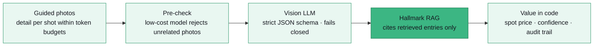

# Marvin Buth

**Full-stack software engineer · TypeScript, Node.js & GenAI** · Frankfurt am Main

I build web products end to end in TypeScript, Node.js and PostgreSQL, and put LLMs into them where they hold up in production: strict schemas, retrieval, evaluation and cost caps. Self-employed since 2017; founder of two products I built myself.

**[cv.marvinbuth.dev](https://cv.marvinbuth.dev)** · [two-page CV](https://cv.marvinbuth.dev/pdf/) · [mail@marvinbuth.dev](mailto:mail@marvinbuth.dev) · [isit.gold](https://isit.gold/)

---

## IsItGOLD?

**Founder & Technical Lead** · [isit.gold](https://isit.gold/) · live on iOS, Android and web

An AI product in production that identifies precious metals in jewellery and ore from guided photos and estimates their value, with subscriptions, a support assistant and an admin dashboard. Flutter, Node.js 20 on Firebase / Google Cloud, Next.js 14 and TypeScript on Vercel.

The model reports facts; code computes money:

- **Retrieval-augmented hallmark resolution.** Production data showed 26.8% of priced scans valued as solid metal although the analysis itself pointed to plating or no gold. I built a RAG step that grounds every read stamp in a curated reference set: hybrid lexical and vector retrieval (OpenAI embeddings, Firestore Vector Search), then a strict-schema LLM call that can only cite retrieved entries. Unambiguous stamps resolve deterministically at no model cost; ambiguous ones add about $0.001 per scan. Projected to remove gross overvaluations on an estimated 4–9% of priced scans; rolling out behind a runtime flag with a record mode to measure it.
- **Grounded support assistant.** Answers from an admin-maintained knowledge base loaded at runtime, returns structured JSON, routes between a fast and a reasoning model; token metering and per-tier cost caps.
- **Evaluation and testing.** Live accuracy harness over a labelled image corpus (metal accuracy, value MAPE), golden fixtures, a mock vision server and 90+ backend test suites.
- **Platform.** Asynchronous scans on Cloud Tasks with an idempotent credit ledger, RevenueCat subscriptions, eBay listing integration with LLM-ranked category suggestions, and an issue-driven GitHub workflow with AI coding agents.

## Tilga

**Founder & Developer** · Sep 2026 – present · closed alpha

A free web app for people in Germany facing several debt collection cases at once: it tracks claims, payments and letters and produces the report a debt counselling centre needs. MVP built in one week. TypeScript monorepo (pnpm, Turborepo), Next.js 16, PostgreSQL on Supabase in Frankfurt, Vercel.

- **Data layer.** PostgreSQL schema with row level security as the only API, 10 versioned SQL migrations, diff-sync of the user's document to the database.
- **Privacy by design.** An offline file mode encrypts all data in the browser (AES-GCM, PBKDF2-derived key); OCR of letters runs on the device with tesseract.js, so photos never leave the browser.
- **Quality.** Zod validation, Vitest unit tests, Playwright end-to-end tests with a committed screenshot set on every pull request, conventional commits with a generated changelog.

---

## Experience

| When | Role | Where |
|---|---|---|
| Sep 2025 – present | Digital Workplace Engineer (Level 3), freelance | EU Anti-Money Laundering Authority (AMLA), Frankfurt |
| Aug 2017 – present | Freelance Software Engineer & IT Consultant | Self-employed, Frankfurt |
| May – Jul 2024 | IT Consultant & Software Developer (working student) | Nterra Integrations GmbH, Darmstadt |
| Sep 2023 – Mar 2024 | Software Developer (working student) | Pickware GmbH, Darmstadt |
| Jul – Sep 2022 | Full-Stack Developer (client project) | M.F.G. Pengueen UG |
| Jan 2020 – Jan 2021 | Software Engineer & Project Manager (client project) | Contyfy Network UG |
| Mar 2019 | Trainee, Innovation Team | European Central Bank, Frankfurt |

At AMLA I was the authority's first IT HUB agent: I built the service from zero and wrote the operating model it runs on (13 standard operating procedures, 52 ServiceNow templates), automated a hardened workstation build in PowerShell with 32 verified security controls, and have resolved 784 tickets with 100% positive end-client satisfaction.

## Skills

**GenAI engineering** · LLM integration (OpenAI Responses API) · retrieval-augmented generation · structured outputs with strict JSON schemas · output validation and retries · model routing · embeddings and Firestore Vector Search · hybrid lexical and vector retrieval · token metering and cost caps · accuracy evaluation on labelled data

**Languages & frameworks** · TypeScript · JavaScript · Node.js · NestJS · React · Next.js · Angular · Vue.js · Flutter / Dart · PHP / Symfony · Python · Java

**Data & cloud** · PostgreSQL · Firestore · MongoDB · Google Cloud / Firebase (Cloud Functions, Cloud Tasks, App Check) · Vercel · AWS · Docker · REST · OAuth · WebSockets

**Practice** · TDD · golden fixtures · Scrum · Kanban · release planning · issue-driven delivery with AI coding agents · security and privacy by design

## Languages and education

German (native) · English (advanced professional) · French (professional working)

Computer Science studies, Goethe University Frankfurt am Main, Oct 2023 – Sep 2025, paused to take up the AMLA assignment.
